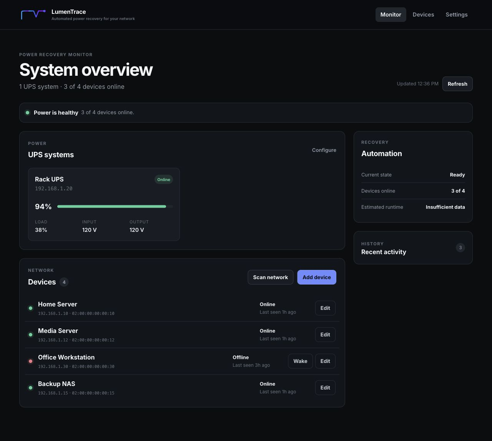

# LumenTrace

**Automated power recovery for your network.**

LumenTrace monitors Network UPS Tools (NUT) servers, remembers which devices
were online when an outage began, and uses Wake-on-LAN to bring them back after
utility power is stable and the UPS batteries have recharged.



## Why LumenTrace?

A conventional Wake-on-LAN tool can turn on a machine, but it does not know
whether that machine was running before a power failure or whether the UPS is
ready to support it again. LumenTrace adds that missing recovery workflow:

1. Monitor every configured UPS and device.
2. Capture the online devices when an outage begins.
3. Persist that recovery list even if the LumenTrace host restarts.
4. Wait until every UPS is back online and above the chosen battery threshold.
5. Send Wake-on-LAN packets only to the devices that were previously online.

## Features

- Multiple NUT/UPS connections
- Persistent outage and recovery states
- Configurable battery threshold before devices are awakened
- Device availability and last-seen monitoring
- Manual and automatic Wake-on-LAN
- On-demand local-network discovery
- Responsive desktop and mobile interface
- Atomic state writes with a rolling backup
- Container health check and reduced Linux capabilities
- `linux/amd64` and `linux/arm64` container images

## Quick start

Create a directory for LumenTrace and save the included `docker-compose.yml`
and `.env.example` files there.

Create the runtime environment file:

```sh
cp .env.example .env
openssl rand -hex 48
```

Paste the generated value into `.env`:

```dotenv
SECRET_KEY=replace-with-your-generated-value
TZ=America/New_York
POLL_INTERVAL=10
```

Start the container:

```sh
docker compose up -d
```

Open:

```text
http://YOUR-SERVER-IP:5000
```

Configure the NUT server under **Settings**, then add devices manually or scan
the local network.

## Docker Compose

```yaml
services:
  lumentrace:
    image: pwsmith1988/lumentrace:2.0.0
    container_name: lumentrace
    restart: unless-stopped
    env_file: .env
    environment:
      TZ: ${TZ:-America/New_York}
      DATA_DIR: /data
    cap_drop:
      - ALL
    cap_add:
      - NET_RAW
    network_mode: host
    read_only: true
    tmpfs:
      - /tmp
    volumes:
      - ./data:/data
```

Host networking is used so ARP discovery and broadcast Wake-on-LAN can reach
the local network. No `ports:` entry is needed: LumenTrace listens directly on
host TCP port `5000`.

## Configuration

| Variable | Required | Default | Description |
| --- | --- | --- | --- |
| `SECRET_KEY` | Yes | — | Long random value used to protect browser sessions and CSRF tokens |
| `TZ` | No | `America/New_York` | Container timezone |
| `POLL_INTERVAL` | No | `10` | Background monitoring interval in seconds |
| `DATA_DIR` | No | `/data` | Container state directory |
| `SESSION_COOKIE_SECURE` | No | `false` | Set to `true` when access is HTTPS-only |
| `RATELIMIT_STORAGE_URI` | No | `memory://` | Shared rate-limit backend for advanced multi-instance deployments |

Do not commit `.env` or reuse the example placeholder as the real secret.

## Updating

Back up the state directory before a major upgrade:

```sh
cp -a ./data ./data-backup
```

Then update:

```sh
docker compose pull
docker compose up -d
docker compose logs --tail 100 lumentrace
```

Existing LumenTrace state files are compatible with v2.0.0. New fields are
merged into the stored state when it loads.

## Data and recovery

State is stored in `/data/state.json`. Writes use an atomic replacement, and
the previous valid state is retained as `/data/state.json.bak`.

The dashboard reports one of four recovery states:

- **Ready** — normal monitoring
- **Outage captured** — devices that were online have been recorded
- **Waiting for recharge** — utility power is back, but one or more UPS units
  are not ready
- **Waking devices** — recovery packets are being sent

## Traefik and remote access

LumenTrace does not include user accounts. Do not expose port 5000 directly to
the public internet. Put it behind HTTPS and an authentication middleware such
as Traefik Basic Auth, Authelia, or Authentik.

Because LumenTrace uses host networking, a bridge-networked Traefik container
should route to the Docker host rather than to a `lumentrace` container name.
A Traefik file-provider service can use:

```yaml
http:
  services:
    lumentrace:
      loadBalancer:
        servers:
          - url: http://host.docker.internal:5000
```

On Linux, add the following to the Traefik service if the host alias is not
already available:

```yaml
extra_hosts:
  - "host.docker.internal:host-gateway"
```

Set this after HTTPS is working:

```dotenv
SESSION_COOKIE_SECURE=true
```

See [SECURITY.md](SECURITY.md) for the project security policy.

## Local development

```sh
python -m venv .venv
. .venv/bin/activate
pip install -r requirements-dev.txt
export DATA_DIR="$PWD/data"
export SECRET_KEY="development-only-secret"
python main.py
```

Open `http://localhost:5000`.

Build locally with the development override:

```sh
docker compose -f docker-compose.yml -f docker-compose.dev.yml up -d --build
```

## Tests

```sh
pytest -q
python -m compileall -q main.py config.py models.py extensions.py routes services utils
```

The test suite covers application routes, settings persistence, atomic state
storage, low-battery recovery, and staggered multi-UPS recovery.

## Automated releases

The included GitHub Actions workflows test every pull request and publish
multi-platform Docker images for tags such as `v2.0.0`.

Add these repository Actions secrets before pushing a release tag:

- `DOCKERHUB_USERNAME`
- `DOCKERHUB_TOKEN`

## Credits and license

LumenTrace was inspired by the original
[wolnut](https://github.com/hardwarehaven/wolnut) project.

The LumenTrace source is released under the [Unlicense](LICENSE). Bundled
third-party assets retain their original licenses; see
[THIRD_PARTY_NOTICES.md](THIRD_PARTY_NOTICES.md) and [LICENSES](LICENSES/).
